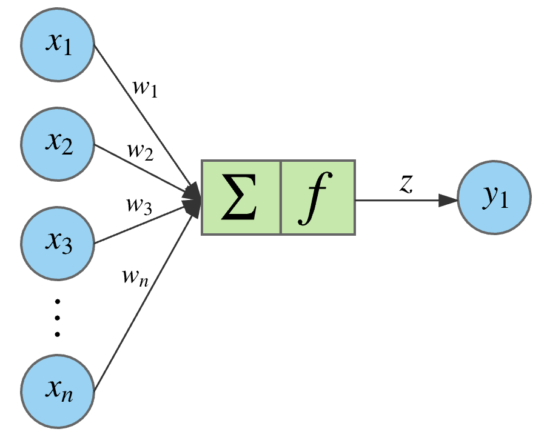
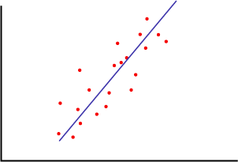
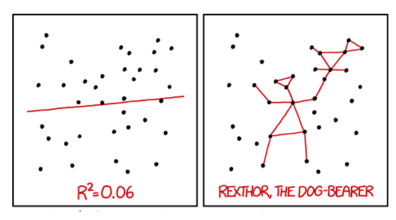
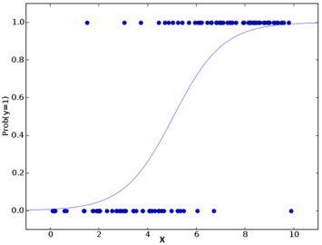

# Introducción y presentación

## Julián Cruz

{width=250px}

Magister en Ciencias y estadístico de la Universidad Nacional de Colombia. Actualmente, docente en la Facultad de Administración de Empresas de la Universidad Externado de Colombia. Con trayectoria de más de 5 años en evaluación de la educación, estudios econométricos, diseño y construcción de índices y modelos de comportamiento del cliente. Sus campos de investigación incluyen entre otros expresión génica, logro académico y responsabilidad social empresarial. Temas de interés: Modelos de Minería de Datos aplicados a la Industria.

## Mi primera Neurona

Es un taller muy introductorio con los contenidos básicos para las personas que quieren tener algún conocimiento en temas de redes neuronales.

## Qué haremos

 - Hablar sobre redes neuronales, qué son.
 - Explicar los fundamentos matemáticos de las redes neuronales.
 - Ajustar una red neuronal pequeña en R.
 - Crear una interfaz para que algún cliente consuma nuestra red neuronal.
 - Sacar todo de la Wikipedia.
 
## Objetivo

El único objetivo es hacer una red neuronal de juguete, que pronostica la estatura a partir de unas preguntas. [Como esta.](https://jjsligaesp.shinyapps.io/rnae/)

## Qué no haremos

 - Deeplearning.
 - Revisar tecnologías y librerías de distintos lenguajes.
 - Profundizar en la teoría matemática.
 - Explicar el machinelearning, ni siquiera se menciona.
 - Hablar sobre inteligencia artificial

## ¿Qué son las redes neuronales?

Una red neuronal es una metáfora...

{width=500px}

## Una neurona artificial

{width=500px}

# Regresión

## El problema de la regresión

{width=500px}

Consiste en determinar las relaciones subyacentes que hay entre unas variables predictoras y una variale respuesta, de manera que mediante valores conocidos de las predictoras sea posible pronosticar un valor desconocido de la respuesta.

## Modelo lineal

{width=300px}

Se trata de una recta (o un plano) que se ajusta para que siga la tendencia general de la nubes de puntos.

 - Sirve para pronosticar variables numéricas.
 - Se ajusta mediante mínimos cuadrados.
 

 
## Restricciones del modelo lineal

{width=600px}

No confíes en el modelo lineal si es más difícil encontrar la línea de tendencia que hacer nuevas constelaciones con los datos.

## Regresión logística

{width=300px}

El ajuste para una variable binaria es una curva de cero a uno.

 - No pronostica el valor de la variable respuesta sino su probabilidad.
 - Presenta inconvenientes con muestras desbalanceadas.

# Métodos de optimización

## Optimizar

Dada una función de costo $f(x)$ y unos puntos factibles $x$ el problema de optimización consiste en encontrar un punto factible cuyo valor de $f(x)$ sea el más bajo posible. Los métodos para la solución de este problema pueden dividirse en dos grandes grupos.

 - Metodos analíticos, que usan las propiedades matemáticas de $f$ para encontrar el punto factible $x$ que alcanza el míinimo.

 - Metodos estocásticos, que prueban $f$ en diferentes puntos factibles $x$ escogidos al azar hasta encontrar uno cercano al óptimo.

 
## Gradiente descendiente

El gradiente de descenso es uno de los métodos analíticos más populares, consiste en situarse en un punto específico, buscar la dirección de mayor descenso y moverse en esta dirección.

## Recocido simulado

Es uno de los métodos de optimización estocástica más eficientes. Consiste en establecer una caminata aleatoria donde en donde un paso mejor se toma de inmediato, pero un paso peor se toma con una probabilidad.

# Explicación de una red neuronal

## Ecuación de la recta en el plano

La ecuación de la recta en el plano es 

$$ f_1(x) = y = mx + b$$

## Función logística en el plano

La ecuación de la función logística en el plano es 

$$f_2(x) = y = \frac{1}{1 + e^{-x}}$$

## Ecuación de la recta matricial

En matrices la ecuación de la recta es la misma

$$ f_1(\textbf{X}) =  \textbf{Y} = \textbf{AX} + \textbf{B}$$

## Función logística matricial

$$f_2(\textbf{X}) = \textbf{Y} = \frac{1}{1 + e^{-\textbf{X}}}$$

## Red neuronal

Una red neuronal es un modelo estadístico anidado.

$$\widehat{\textbf{Y}} = f_1(f_2(f_1(f_2(...f_1(X))))) $$

## Una capa

$$f_1(X) = \textbf{A}_1\textbf{X} + \textbf{B}_1$$

$$f_2(f_1(X)) = \frac{1}{1 + e^{-(\textbf{A}_1\textbf{X} + \textbf{B}_1)}}$$

## y sigue

$$f_2(f_1(X)) = \frac{1}{1 + e^{-(\textbf{A}_1\textbf{X} + \textbf{B}_1)}}$$
$$f_1(f_2(f_1(X))) = \textbf{A}_2\frac{1}{1 + e^{-(\textbf{A}_1\textbf{X} + \textbf{B}_1))}} + \textbf{B}_2$$

## Dos capas

$$f_1(f_2(f_1(X))) = \textbf{A}_2\frac{1}{1 + e^{-(\textbf{A}_1\textbf{X} + \textbf{B}_1))}} + \textbf{B}_2$$

$$f_2(f_1(f_2(f_1(X)))) = \frac{1}{1 + e^{-\left(\textbf{A}_2\frac{1}{1 + e^{-(\textbf{A}_1\textbf{X} + \textbf{B}_1))}} + \textbf{B}_2\right)}}$$

## Función de costo

La función de costo para una salida contínua es 

$$f(\{\textbf{A}_c, \textbf{B}_c\}_{c \in 1:N_c}) = \frac{1}{2} \sum\limits_{i \in 1:n} (\textbf{Y}_i - \widehat{\textbf{Y}_i})^2$$

## Estimación (back propagation)

Back Propagation es la implementación del gradiente de descenso para redes neuronales.

## Algunos libros

[Carpeta de libros](https://www.dropbox.com/sh/j9bkfg6xqmeui03/AAAg1m6OrFeKbO-ToRPOdu8ma?dl=0)

# Manos a la obra

## Ajuste de la red neuronal

[Código del ajuste](https://gist.github.com/CruzJulian/b0598699e16e5cea2ed4dc68d5334d80)

## Aplicación para mostrarla

[Código Shiny](https://gist.github.com/CruzJulian/26aae2b5d5ece2cd98c7c86dda8a1329)